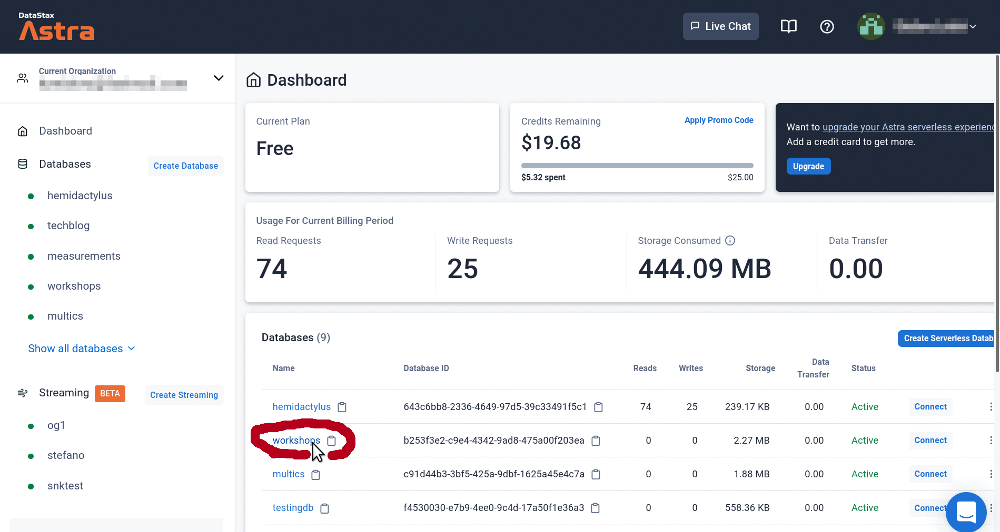
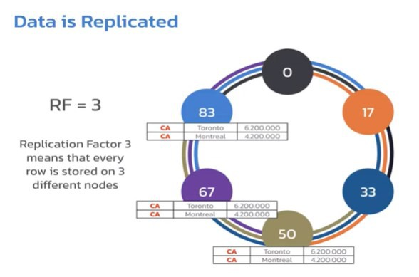
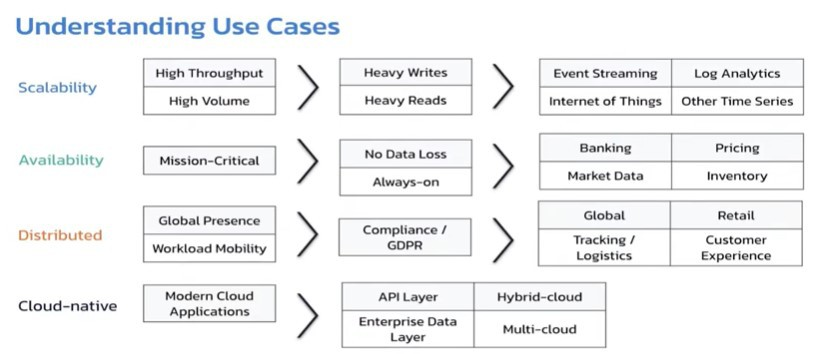
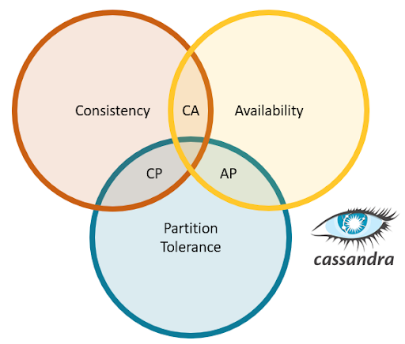

# Cassandra Day Brasil 2022

## Introdução ao Cassandra

<aside>
👨🏾‍💻 **Cassandra Day Brasil 2022 - Sessão Workshops - Primeiro Dia**
 (Tiago Alves & Stefano Lottini, DataStax)

</aside>

## ToC (Índice de navegação do conteúdo)

[Apache Cassandra](#apache-cassandra)
[Principais Características do Cassandra](#principais-características-do-cassandra)
    [Performance de Leitura e Escrita](#performance-de-leitura-e-escrita)
    [Escalabilidade Linear](#escalabilidade-linear)
    [Alta Disponibilidade](#alta-disponibilidade)
    [Auto-recuperação e Automação](#auto-recuperação-e-automação)
    [Distribuição Geográfica](#distribuição-geográfica)
    [Agnóstico à plataforma](#agnóstico-à-plataforma)
    [Independe do Fornecedor (software livre)](#independe-do-fornecedor-software-livre)
[Hands on](#hands-on)
    [1. Criar database no DataSax](#1-criar-database-no-datasax)
    [2. Criar Tabelas](#2-criar-tabelas)
        [2.1 - Criar tabela de usuários](#21---criar-tabela-de-usuários)
        [2. 2 - Criar Tabela de Posts](#2-2---criar-tabela-de-posts)
    [3. Execute CRUD operations](#3-execute-crud-operations)
        [3.1 CRUD - Create data](#31-crud---create-data)
            [3.1.1 - (C)RUD = create = inserindo dados na tabela users](#311---crud--create--inserindo-dados-na-tabela-users)
            [3.1.2 - (C)RUD = create = inserindo dados na tabela posts_by_user](#312---crud--create--inserindo-dados-na-tabela-posts_by_user)
            [3.1.3 - (C)RUD = create (inserindo dados na tabela posts_by_room)](#313---crud--create-inserindo-dados-na-tabela-posts_by_room)
        [3.2 C(R)UD = read (Consultando os dados)](#32-crud--read-consultando-os-dados)
        [3.3 CR(U)D = update (modificando os dados)](#33-crud--update-modificando-os-dados)
        [3.4 CRU(D) = delete = remove data](#34-crud--delete--remove-data)


# Apache Cassandra

Sistema de Gerenciamento de Banco de Dados NoSQL Distribuído e Descentralizado

## Principais Características do Cassandra

### Performance de Leitura e Escrita


### Escalabilidade Linear

- Não há limites de volume e velocidade
- Não há penalização por novos nodos criados


### Alta Disponibilidade

- Sem pontos de falha no cluster e no datacenter


### Auto-recuperação e Automação

Clusters são capazes de escala e distribuição de maneira inteligente e automática

### Distribuição Geográfica

Instalações multi-datacenter para tolerar possíveis falhas. Não são apenas réplicas, mas cada cluster é totalmente funcional para leitura e/ou escrita


### Agnóstico à plataforma

Pode ser usado em qualquer nuvem, em várias nuvens, em servidor local ou uma mistura de local e nuvem


### Independe do Fornecedor (software livre)


## Hands on

CQL (Cassandra Query Language) é uma linguagem de consulta semelhante ao SQL. As informações são gravadas em tabelas

---

### 1. **Criar database no DataSax**

| Parameter | Value |
| --- | --- |
| Database name | workshops |
| Keyspace name | chatsandra |
- Abra o CQL Console
    
    
    
- Como os dados são distribuídos no Cassandra
    
    Conceitualmente , cada tabela é uma entidade única, mas fisicamente seus dados estão distribuídos dentro dos nós do Cassandra
    
    
    
    Para distribuir as informações, o Cassandra utiliza uma **chave de particionamento** (***Partition Key***)
    
    
    
    Dados que pertencem á um determinado país, e possuem a mesma chave de particionamento são armazenados no mesmo nódulo.
    
    Todas as os dados de chaves de um particionamento estão em um mesmo nódulo do anel. 
    
    Cada Partition Key é calculado pelo altoritimo de Murmur3 Hash, que atribui um intervalo de token aleatório para atribuir os dados de uma determinada chave à um determinado cluster.
    
    
    
    No exemplo temos 04 chaves de partição, que receberão igualmente uma parte do intervado dos tokens disponíveis. Exemplo: dados da chave AU (Austrália) serão adicionados nos nodos de 51-75, enquanto dados do CA (Canadá) serão distribuídos no nodos de 1-25 e assim por diante de acordo com a divisão dos tokens.
    
    
    
    Todo processo de alteração dos nodos não altera o funcionamento do banco de dados. O processo de divisão ocorre automaticamente enquanto a aplicação funciona como se nada estivesse ocorrendo.
    
    
    
    
    
    **Cenários  onde um banco de dados distribuído pode ser bem aproveitados**
    
    
    
    - 
    
- Teorema de CAP
    
    **Teorema do CAP**, também chamado de **Teorema de Brewer**, afirma que é impossível que o armazenamento de dados distribuído forneça simultaneamente mais de duas das três garantias seguintes:
    
    | Consistência | Disponibilidade (Availability) | Partição tolerante a falhas |
    | --- | --- | --- |
    | Cada leitura recebe a escrita mais recente ou um erro | Cada pedido recebe uma resposta (sem erro) - sem garantia de que contém a escrita mais recente | O sistema continua a funcionar apesar de um número arbitrário de mensagens serem descartadas (ou atrasadas) pela rede entre nós |
    
    Em outras palavras, o teor do CAP afirma que, na presença de uma partição da rede, é preciso escolher entre consistência e disponibilidade. Observe que a consistência conforme definido no teor de CAP é bastante diferente da consistência garantida em [transações de bases de dados](https://pt.wikipedia.org/wiki/Transa%C3%A7%C3%A3o_em_base_de_dados) [ACID](https://pt.wikipedia.org/wiki/ACID).
    
    **Cassandra é AP, CA ou CP?  É AP**
    
    O Apache Cassandra se enquadra no sistema AP, o que significa que o Cassandra é válido para **Disponibilidade** e **Tolerância de Partição** , mas não para **Consistência** , mas isso pode ser ajustado ainda mais por meio do fator de replicação (quantas cópias de dados) e nível de consistência (leitura e gravação).
    
    
    
    Cassandra is typically classified as an AP system, meaning that availability and partition tolerance are generally considered to be more important than consistency.
    
    ### References
    
    [CAP Theorem: Why You Can't Have It All](https://dev.to/katkelly/cap-theorem-why-you-can-t-have-it-all-ga1)
    
    [How is the consistency level configured?](https://docs.datastax.com/en/archived/cassandra/3.0/cassandra/dml/dmlConfigConsistency.html)
    
- Consistencia dos nodos
    
    
    
- Resumo estrutura para criação de um banco de dados
    
    
    
    
    

### 2. Criar Tabelas

> *Embora a sintaxe o CQL seja semelhante à do SQL, as consultas devem ser escritas com a sintaxe do Cassandra, e não no SQL*
> 

### 2.1 - Criar tabela de usuários

`DESC KEYSPACES;`

`USE chatsandra;`

```sql
CREATE TABLE IF NOT EXISTS users (
  email       TEXT,
  name        TEXT,
  password    TEXT,
  user_id     UUID,
  PRIMARY KEY (( email ))
);
```

`DESC TABLES;`

### 2. 2 - Criar Tabela de Posts

Na primeira tabela, teremos todos os posts de um determinado usuário

```sql
CREATE TABLE IF NOT EXISTS posts_by_user (
user_id     UUID,
post_id     TIMEUUID,
room_id     TEXT,
text        TEXT,
PRIMARY KEY ((user_id), post_id)
) WITH CLUSTERING ORDER BY (post_id DESC);
```

Na segunda teremos todos os posts de uma sala.

```sql
CREATE TABLE IF NOT EXISTS posts_by_room (
room_id     TEXT,
post_id     TIMEUUID,
user_id     UUID,
text        TEXT,
PRIMARY KEY ((room_id), post_id)
) WITH CLUSTERING ORDER BY (post_id DESC);
```

<aside>
💡 *Duplicar registros em diversas tabelas é comum em bancos noSQL, pois o objetivo de bancos de dados não relacionais é a DESNORMALIZACAÇÃO dos dados.*

</aside>

`DESC TABLES;`

---

## **3. Execute CRUD operations**

## 3.1 CRUD - Create data

> CRUD stands for "**create, read, update, and delete**".
> 

### 3.1.1 - **(C)RUD = create = inserindo dados na tabela *users***

Para inserir os dados, podemos utilizar uma escrita separando por linhas

```sql
INSERT INTO users (
email,    // TEXT
name,     // TEXT
password, // TEXT
user_id   // UUID: id of a user
)
VALUES (
'jonasaacampos@hire-me.com',
'Jonas Campos',
'123456',
11111111-1111-1111-1111-111111111111
);
```

Ou escrever em uma mesma linha

```sql
INSERT INTO users (email, name, password, user_id) VALUES (
'fred@qmail.net', 'Fred Fivey', 'qwerty',
55555555-5555-5555-5555-555555555555
);
```

```sql
INSERT INTO users (email, name, password, user_id) VALUES (
'nina@zmail.org', 'Nina Niney', 's3cr3t',
99999999-9999-9999-9999-999999999999
);
```

### 3.1.2 - **(C)RUD = create = inserindo dados na tabela *posts_by_user***

```sql
// Insert some data in the "posts_by_user" table
INSERT INTO posts_by_user (
user_id,  // UUID: unique id for a user
post_id,  // TIMEUUID: unique uuid + timestamp
room_id,  // TEXT: id of a chat room
text      // TEXT: the post content itself
)
VALUES (
11111111-1111-1111-1111-111111111111,
22222222-5cff-11ec-be16-1fedb0dfd057,
'#hiking',
'I climbed Mt. Gumbo yesterday ...'
);
```

```sql
INSERT INTO posts_by_user (user_id, post_id, room_id, text) VALUES (
11111111-1111-1111-1111-111111111111,
77777777-5cff-11ec-be16-1fedb0dfd057,
'#running', 'Who likes marathons here?'
);
INSERT INTO posts_by_user (user_id, post_id, room_id, text) VALUES (
11111111-1111-1111-1111-111111111111,
aaaaaaaa-5cff-11ec-be16-1fedb0dfd057,
'#hiking', '... and Mt. Gumbo was easy!!!'
);
INSERT INTO posts_by_user (user_id, post_id, room_id, text) VALUES (
55555555-5555-5555-5555-555555555555,
bbbbbbbb-5cff-11ec-be16-1fedb0dfd057,
'#hiking', 'For us humans Gumbo is a tough one...!'
);
INSERT INTO posts_by_user (user_id, post_id, room_id, text) VALUES (
99999999-9999-9999-9999-999999999999,
cccccccc-5cff-11ec-be16-1fedb0dfd057,
'#running', 'I just love marathons.'
);
INSERT INTO posts_by_user (user_id, post_id, room_id, text) VALUES (
11111111-1111-1111-1111-111111111111,
eeeeeeee-5cff-11ec-be16-1fedb0dfd057,
'#running', 'Same here!'
);
INSERT INTO posts_by_user (user_id, post_id, room_id, text) VALUES (
55555555-5555-5555-5555-555555555555,
ffffffff-5cff-11ec-be16-1fedb0dfd057,
'#hiking', 'I have to buy new boots.'
);
```

### 3.1.3 - **(C)RUD = create (inserindo dados na tabela *posts_by_room)***

```sql
// Insert some data in the "posts_by_room" table
INSERT INTO posts_by_room (user_id, post_id, room_id, text) VALUES (
11111111-1111-1111-1111-111111111111,
22222222-5cff-11ec-be16-1fedb0dfd057,
'#hiking', 'I climbed Mt. Gumbo yesterday ...'
);
```

```sql
INSERT INTO posts_by_room (user_id, post_id, room_id, text) VALUES (
11111111-1111-1111-1111-111111111111,
77777777-5cff-11ec-be16-1fedb0dfd057,
'#running', 'Who likes marathons here?'
);
INSERT INTO posts_by_room (user_id, post_id, room_id, text) VALUES (
11111111-1111-1111-1111-111111111111,
aaaaaaaa-5cff-11ec-be16-1fedb0dfd057,
'#hiking', '... and Mt. Gumbo was easy!!!'
);
INSERT INTO posts_by_room (user_id, post_id, room_id, text) VALUES (
55555555-5555-5555-5555-555555555555,
bbbbbbbb-5cff-11ec-be16-1fedb0dfd057,
'#hiking', 'For us humans Gumbo is a tough one...!'
);
INSERT INTO posts_by_room (user_id, post_id, room_id, text) VALUES (
99999999-9999-9999-9999-999999999999,
cccccccc-5cff-11ec-be16-1fedb0dfd057,
'#running', 'I just love marathons.'
);
INSERT INTO posts_by_room (user_id, post_id, room_id, text) VALUES (
11111111-1111-1111-1111-111111111111,
eeeeeeee-5cff-11ec-be16-1fedb0dfd057,
'#running', 'Same here!'
);
INSERT INTO posts_by_room (user_id, post_id, room_id, text) VALUES (
55555555-5555-5555-5555-555555555555,
ffffffff-5cff-11ec-be16-1fedb0dfd057,
'#hiking', 'I have to buy new boots.'
);
```

### **3.2 C(R)UD = read (Consultando os dados)**

> uma consulta que retorna todos os resultados não é adequada, pois como os dados são replicados, o retorno dos dados pode ser muito oneroso para o banco de dados
> 

```sql
// Read all rows from "posts_by_user" table (careful with this ...)
SELECT * FROM posts_by_user;
```

Uma consulta adequada seria utilizarmos a cláusula WHERE, pois os resultado traria todos os dados de apenas uma pessoa. Mesmo que haja 10mil nodos, o tempo da consulta não será afetado, pois basta a resposta de apenas um nodo.

```sql
// Read (some columns of) rows in a certain partition of "posts_by_user" table
SELECT post_id, room_id, text FROM posts_by_user
WHERE user_id = 11111111-1111-1111-1111-111111111111;
```

- Resultado desta consulta (tabela *posts_by_user*)
    
    
    

Da mesma maneira podemos selecionar os dados contidos na tabela das salas (posts_by_room)

```sql
// Read (some columns of) posts from a certain room (= a certain partition)
SELECT user_id, text FROM posts_by_room WHERE room_id = '#hiking';

```

```sql
// Read the whole "posts_by_room" table
SELECT * FROM posts_by_room;
// (warning: not suitable for large tables in production)
```

- Resultado da consulta na tabela *posts_by_room*
    
    
    

```sql
// Read all data from the posts_by_room table,
// convert post_id into a timestamp, and label the column "post_date"
SELECT user_id, dateOf(post_id) AS post_date, text FROM posts_by_room
WHERE room_id = '#hiking';
```

### **3.3 CR(U)D = update (modificando os dados)**

```sql
// ** Just for reference: **
INSERT INTO posts_by_user (user_id, post_id, room_id, text) VALUES (
	11111111-1111-1111-1111-111111111111,
	aaaaaaaa-5cff-11ec-be16-1fedb0dfd057,
	'#hiking', '... and Mt. Gumbo was NOT easy!!!');
```

Agora a nossa postagem foi alterada!

```sql
SELECT post_id, room_id, text FROM posts_by_user
WHERE user_id = 11111111-1111-1111-1111-111111111111;
```

Lembre sempre que é preciso alterar todas as tabelas, pois os dados estão desnormalizados

```sql
UPDATE posts_by_user
SET text = '... and Mt. Gumbo was NOT easy!!!'
WHERE user_id = 11111111-1111-1111-1111-111111111111
AND   post_id = aaaaaaaa-5cff-11ec-be16-1fedb0dfd057;
```

```sql
SELECT post_id, room_id, text FROM posts_by_user
	WHERE user_id = 11111111-1111-1111-1111-111111111111;
```

Resultado com a tabela alterada


- **Resultado antes do update (dados originais)**
    
    
    

### **3.4 CRU(D) = delete = remove data**

```sql
SELECT post_id, room_id, text FROM posts_by_user
WHERE user_id = 55555555-5555-5555-5555-555555555555;
```


```sql
DELETE FROM posts_by_user
WHERE user_id = 55555555-5555-5555-5555-555555555555
AND post_id = bbbbbbbb-5cff-11ec-be16-1fedb0dfd057;
```

**Após o Delete**


```sql
SELECT post_id, user_id, text FROM posts_by_room WHERE room_id = '#hiking';
```


```sql
DELETE FROM posts_by_room
WHERE room_id = '#hiking'
AND post_id = bbbbbbbb-5cff-11ec-be16-1fedb0dfd057;
```

- **Após o delete**
    
    
    

```sql
SELECT post_id, room_id, text FROM posts_by_user
WHERE user_id = 55555555-5555-5555-5555-555555555555;
```

```sql
SELECT post_id, user_id, text FROM posts_by_room WHERE room_id = '#hiking';
```

**Resultado atual da consulta no banco de dados**

